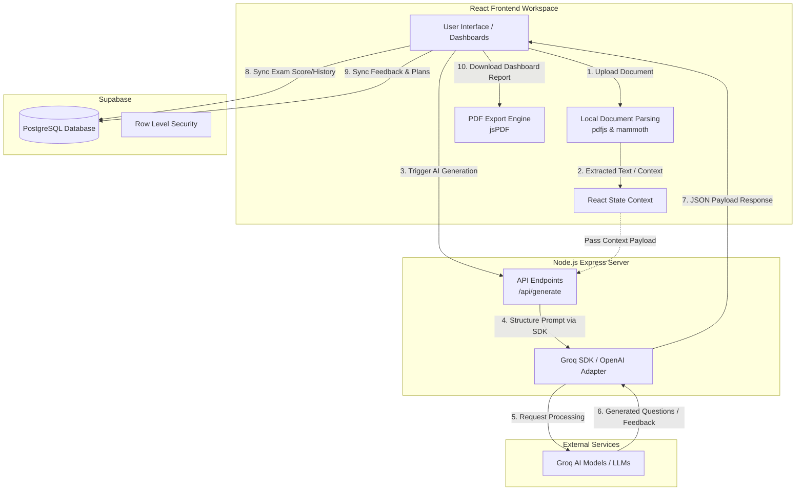
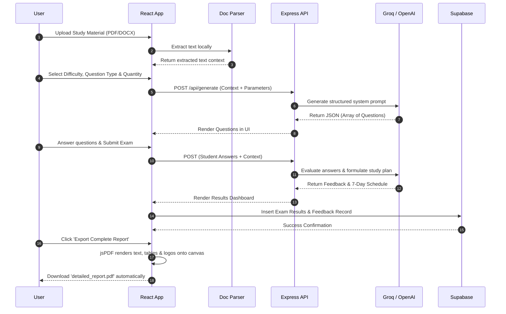

# Personalized Learning AI Assistant 🎓

An advanced, full-stack intelligent learning platform designed to help students generate practice questions, simulate mock exams, and build customized 7-day study plans. The platform leverages **Retrieval-Augmented Generation (RAG)** by allowing users to upload their own study materials (PDF/DOCX) to build a custom knowledge base for AI-assisted learning.

## ✨ Core Features

- **Intelligent Document Processing:** Upload PDFs and DOCX files. The app locally extracts text content to establish contextual bounds for the AI.
- **AI-Powered Question Generation:** Automatically creates objective or subjective questions across different difficulty levels using the Groq AI API.
- **Mock Exam Simulation:** Practice generated questions in a focused, timed exam environment.
- **Automated AI Feedback:** Instantly analyzes user answers, provides corrections, and offers a detailed performance evaluation.
- **7-Day Study Planner:** Dynamically generates an actionable, day-by-day study schedule targeting the user's weak areas identified during the mock exam.
- **Comprehensive PDF Exports:** Download beautiful, fully-paginated PDF reports encompassing performance metrics, subject reviews, and study schedules—complete with custom branding and logos.
- **Cloud Database Tracking:** Seamlessly syncs exam history, scores, and feedback to Supabase in real-time.

---

## 🛠️ Tech Stack

- **Frontend:** React 18, Vite, TypeScript, Tailwind CSS, shadcn/ui.
- **Backend / API Wrapper:** Node.js, Express.
- **Artificial Intelligence:** Groq SDK, OpenAI SDK (LLM generation).
- **Document Processing:** `pdfjs-dist` (PDF Parsing), `mammoth` (DOCX Parsing).
- **Database:** Supabase (PostgreSQL).
- **PDF Generation:** `jspdf`, `jspdf-autotable`.

---

## 🏗️ System Architecture

The overarching system utilizes a decoupled frontend and backend approach to maintain secure API key management while interacting with external AI providers and tracking data in Supabase.



---

## 🔄 End-to-End Workflow

The user journey is tailored to guide students from raw document uploading straight through to actionable learning feedback.



---

## 🚀 Local Setup & Installation

Follow these steps to spin up the local development environment:

### 1. Clone the repository

```sh
git clone https://github.com/KowshikSuggala25/Personalized-Learning-Assistant.git
cd Personalized-Learning-Assistant
```

### 2. Install Dependencies

```sh
npm install
```

### 3. Setup Environment Variables

Create a `.env` file in the root directory and ensure the following variables are configured appropriately:

```env
# Backend API Keys (Groq or OpenAI)
GROQ_API_KEY=your_groq_api_key_here

# Supabase Local/Remote Connection
VITE_SUPABASE_URL=your_supabase_project_url
VITE_SUPABASE_ANON_KEY=your_supabase_anon_key

# Backend port configuration
PORT=5000
```

### 4. Database Setup (Supabase)

To ensure everything functions properly, run the provided SQL scripts (`supabase_schema.sql` and `supabase_rls_fix.sql`) in your Supabase SQL Editor to establish the required tables (`exams`, `mock_exams`, `exam_feedback`) and bypass any strict RLS policies hindering local inserts.

### 5. Start the Application

You'll need to run both the frontend React server and the NodeJS backend server simultaneously.

**Start the React Development Server:**

```sh
npm run dev
```

**Start the Express Backend Server:**
In a separate terminal, run:

```sh
npm run start
```

### 6. View the App

Open your browser and navigate to the local host address provided by Vite (normally `http://localhost:8080` or `http://localhost:5173`). Have fun studying!
